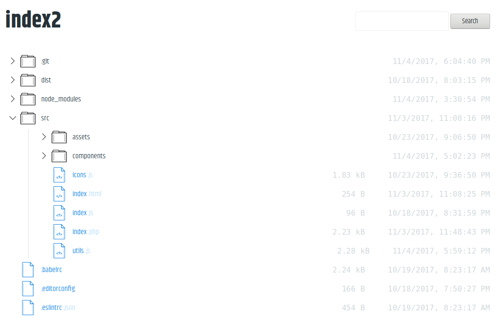

# index2

The next-generation index page.

In the future we plan to support a multitude of server backends, but for now PHP is supported.

## Installation

Drop the built `index.php` into the directory you want to serve from.

## Implementing a backend

It should be straightforward to implement a backend for a new server type, there are only three things that the backend must do.

1. Serve the static html in `src/index.html` by default (Route: `/`)
2. Non-recursively list all files in a directory specified by `path` search parameter (Route: `/?path={path}`)
3. Recursively search for all filename matches specified by `search` search parameter with an optional starting path parameter (Route: `/?search={search}[&path={path}]`)

Responses for items 2 and 3 should validate against included `schema.json` JSON schema.

## ⚠ **WARNING** ⚠

It should be assumed that the existing PHP backend is currently unsafe and metadata for any file on your system can be exposed. Please use discretion before deploying this on a server that contains any private or important files.
